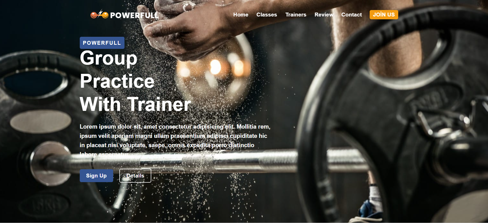
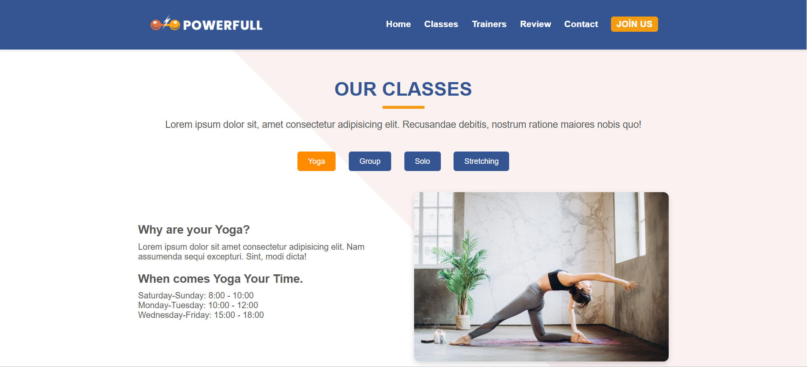
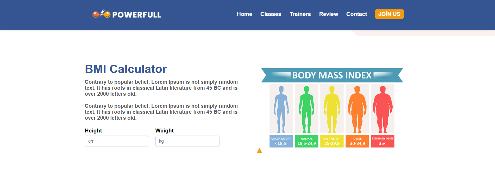
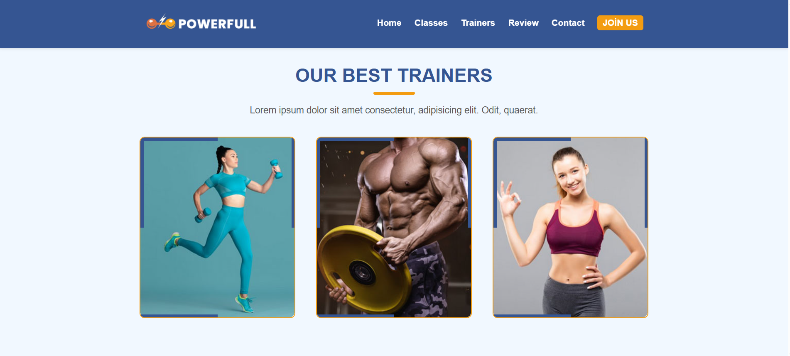
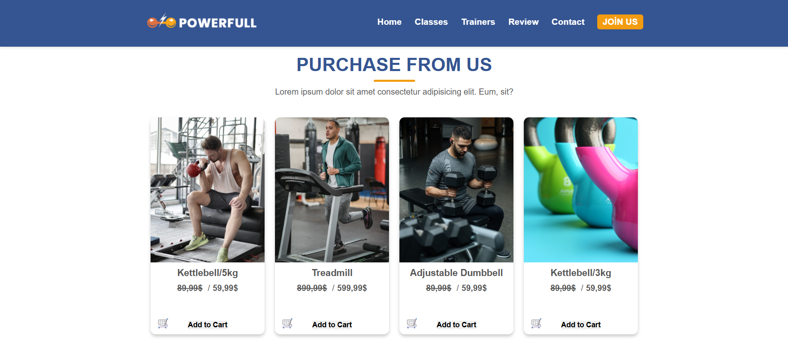
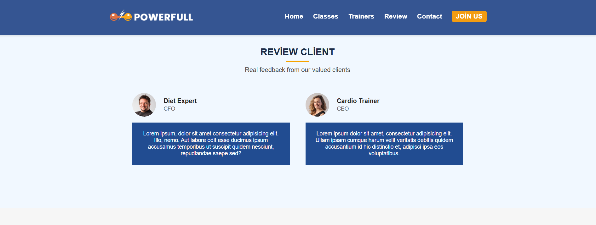
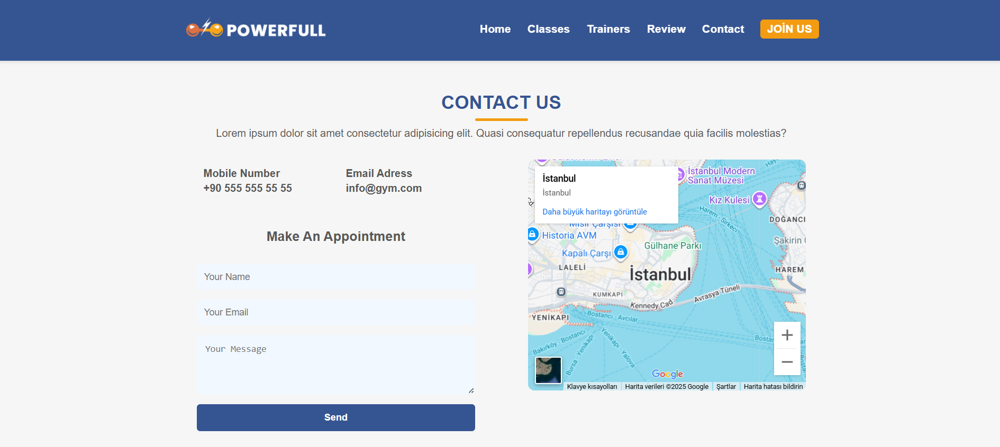
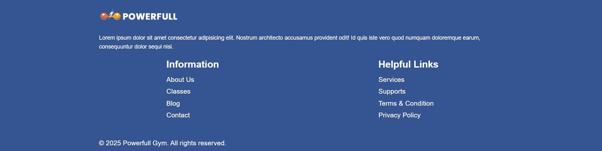

# 💪 Powerfull Gym Web Sitesi

Modern ve responsive bir **spor salonu web sitesi** tasarımı. HTML, CSS ve JavaScript ile geliştirilmiş olup, kullanıcı deneyimi odaklı özellikler içerir.

---

## 🌐 Canlı Site

Projenin canlı versiyonuna buradan ulaşabilirsiniz:  
[**Powerfull Gym Live Site**](https://68b4487baed7467e99ffd1c1--exquisite-melomakarona-c8312d.netlify.app/)

---

## 🚀 Özellikler

- ✅ **Navbar Scroll Efekti:** Sayfa kaydırıldığında renk değişimi ve gölge efekti  
- ✅ **Hero Bölümü:** Büyük görsel ve çağrı butonları  
- ✅ **Sınıf Sekmeleri (Classes):** İçerik değişimi ve aktif buton efekti  
- ✅ **BMI Hesaplayıcı:** Boy ve kilo girerek BMI değerini hesaplama  
- ✅ **Trainer Bölümü:** Antrenörler ve overlay bilgiler  
- ✅ **Satın Alma (Purchase) Bölümü:** Ürünler, fiyatlar ve sepete ekleme  
- ✅ **Review Bölümü:** Müşteri yorumları  
- ✅ **Contact Bölümü:** Form ve harita  
- ✅ **Responsive Tasarım:** Mobil ve tablet uyumlu  
- ✅ **Hamburger Menü:** Küçük ekranlar için açılır menü

---

## 📸 Ekran Görüntüleri

### Hero Bölümü

### Classes Bölümü

### BMI Hesaplayıcı

### Trainer Bölümü

### Purchase Bölümü

### Review Bölümü

### Contact Bölümü

### Footer Bölümü

---

## 🗂️ Dosya Yapısı

/proje-klasoru
│-- index.html
│-- style.css
│-- script.js
│-- Resimler/
│-- README.md

--

## 🛠️ Kurulum

1. Depoyu bilgisayarınıza klonlayın veya zip olarak indirin.  
2. `index.html`, `style.css`, `script.js` ve `Resimler/` klasörünü aynı dizinde tutun.  
3. `index.html` dosyasını tarayıcıda açın veya Visual Studio Code’da **Live Server** ile çalıştırın.

---

## ⚡ Kullanılan Teknolojiler

- HTML  
- CSS (Custom + Variables)  
- JavaScript  
- Visual Studio Code  

---

## 📜 Lisans

Bu proje eğitim ve kişisel kullanım amaçlıdır.